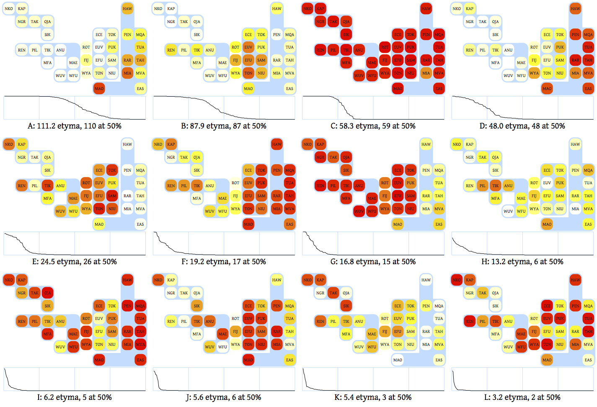

# BUNDLE

BUNDLE finds isogloss bundles (typical feature distributions) in a dialect continuum.  Given a binary feature matrix (N features by L languages) it will construct clusters of features that have similar distributions over the L languages.  This is the opposite of the typical clustering model which clusters objects by their features.  Other notable properties of BUNDLE are:

* It will automatically infer the number of clusters in the data.
* It incorporates a simple _attestation model_ that assumes that a given fraction of the features in any language will go unattested.

BUNDLE does not plot the results, but here is what a typical result would look like if plotted.  This shows how 422 Polynesian etyma, grouped into twelve clusters, are distributed over 35 Central Pacific languages.   Each clusters consists of etyma with similar distributions.

* [Download and run BUNDLE|Tutorial]
* [BUNDLE design and implementation|Overview]
