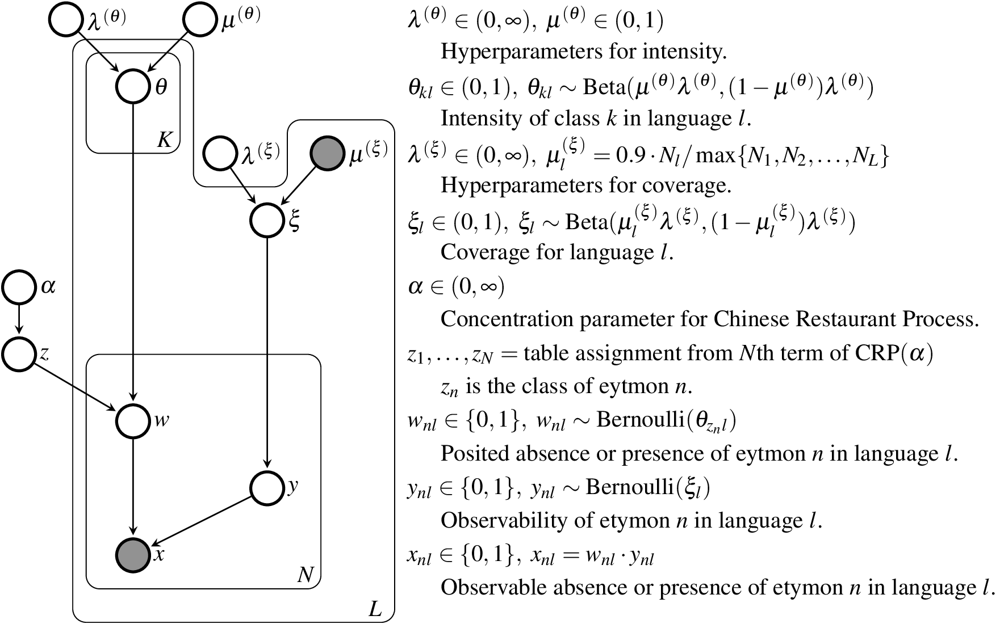

# BUNDLE

BUNDLE is a model for finding isogloss bundles (typical feature distributions) in a dialect continuum.  Given a binary feature matrix (N features by L languages) it will construct clusters of features that have similar distributions in the L languages.  This is the opposite of many clustering models that cluster objects by their features.  Other notable properties of BUNDLE are:

* It will automatically infer the number of clusters in the data.
* It incorporates a simple _attestation model_ that assumes that a given fraction of the features in any language will go unattested.

Generally speaking, BUNDLE is a model whereby the data is generated probabilistically via a set of parameters.  Since many parameterizations generate the data with _some_ probability, BUNDLE infers a probability distribution over parameterizations.  BUNDLE constructs this distribution by sampling from it via a [Monte Carlo Markov chain](http://en.wikipedia.org/wiki/Markov_chain_Monte_Carlo) (MCMC).

The design and implementation of the probabilistic model are discussed [here](http://www.github.com) and summarized in the following diagram.



## Download BUNDLE

You can work with the Scala source code for BUNDLE by cloning this repository and running [sbt 0.13.1](http://www.scala-sbt.org/0.13.1/docs/Getting-Started/Setup.html).  However, most people would rather download the [latest build](http://www.github.com).  Unzip the build to find:

* `bundle-0.1.0.jar`, a fat jar file with two main classes:
  * `bundle.Bundle` generates posterior distribution trace files.
  * `bundle.Align` summarizes a random set partition variable.
* `poly/poly.conf`, a demo configuration file.
* `poly/poly.tsv`, data for the demo.

## Run BUNDLE on demo data

Before running, take a look at the configuration file `poly/poly.conf`:

```
data        poly.tsv          # Input filename for binary matrix data.
base        poly              # Output filenames all begin with this string.
chainlen    10000             # Run MCMC for 10000 states.
burnin      2000              # Discard first 2000 states.
infofreq    10                # Report to the terminal every 10 states.
dumpfreq    100               # Sample every 100 states.
```

The data file `poly.tsv` codes whether each of 422 etyma exist in each of 35 Central Pacific languages.  Each etymon is thus considered a linguistic feature.  This data was excerpted from a 2006 version of [POLLEX](http://pollex.org.nz), a very larger comparative Polynesian word list.  It takes the form of a 422×35 binary matrix with tab-separated values.  The first row contains labels for languages; the first column contains labels for features.  The rest of the cells contain either `0` or `1`.

Now run:

```
java -cp bundle-0.1.0.jar bundle.Bundle poly/poly.conf
```

It will take around ten minutes to run to completion.  Every 10 states it will write a short summary of the MCMC state to `poly.out` and also to the terminal.  For example, it will write:

```
--- 2300 ---
[α   4.6750] [ρμ   0.4749 ρλ   0.7799] [ζλ   0.8721] [K  26]
116 85 59 45 35 15 14 11 6 5 5 4 4 3 2 2 2 1 1 1 1 1 1 1 1 1
[ll    -11260.12] [z      -914.47] [y     -6305.70] [x     -4039.96]
WYA 11 FIJ 53 ROT 44 TON 99 NIU 87 EUV 83 EFU 99 SAM 96 TOK 76 ECE 80
WUV 70 WFU 60 MAE 71 MFA 59 TIK 82 ANU 55 REN 98 PIL 62 KAP 75 NKO 79
TAK 83 OJA 76 SIK 79 NGR 27 PUK 97 EAS 59 MAO 99 TUA 93 PEN 81 RAR 94
MIA  7 TAH 86 HAW 88 MQA 91 MVA 59
```

* First line: The MCMC is at state 2300.
* Second line: `α`, `ρμ`, `ρλ`, `ζλ` are model hyperparameters.  `K` is the number of clusters, which varies from sample to sample.
* Third line: These numbers are the size of each cluster, starting from the largest.  They sum to 422, the number of etyma in the model.
* Fourth line: `ll` is the log likelihood of the model given . . .
* Other lines: Inferred lexicographic coverage rate for each language, normalized to 99.For example, XX etyma are attested for Anuta (ANU) in the data matrix, but in this instance the model believes that XX (of the 422 in the dataset) actually exist in Anuta.  Hence it reports that Anuta has a lexicographic coverage of XX/XX = 55%.

Every 100 MCMC states, BUNDLE write out the entire model state over several files:

* `poly.log`
* `poly.z.log`
* `poly.y.100.hex`, etc.

When `Bundle` completes, run:

```
java -cp bundle-0.1.0.jar bundle.Align poly/poly.conf
```

